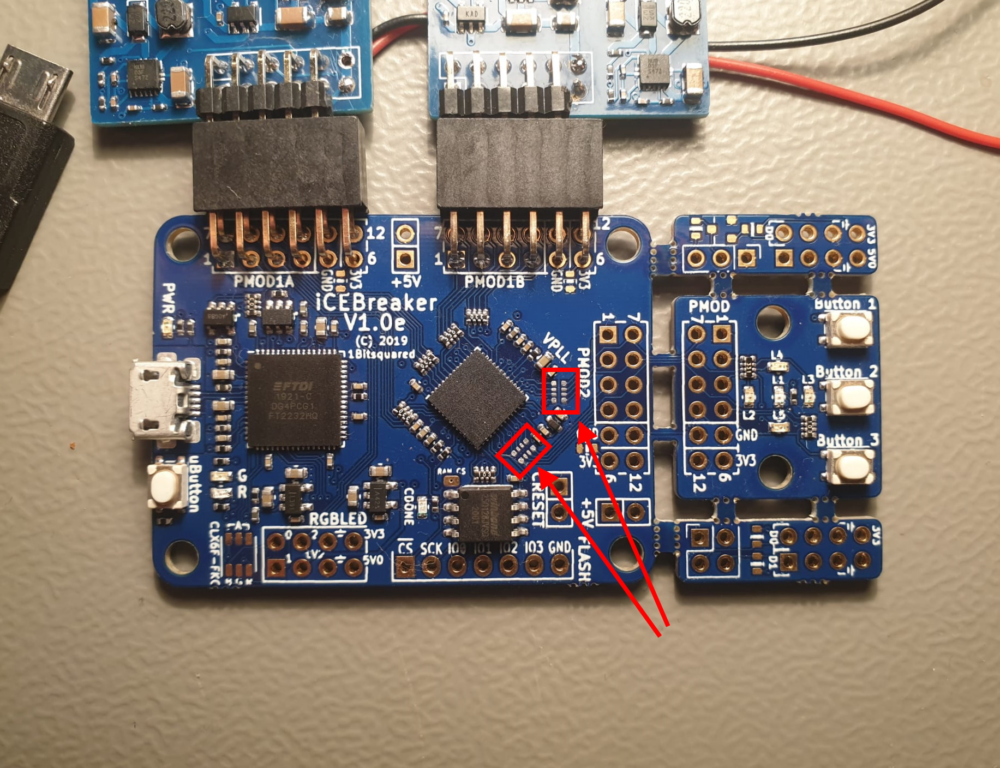
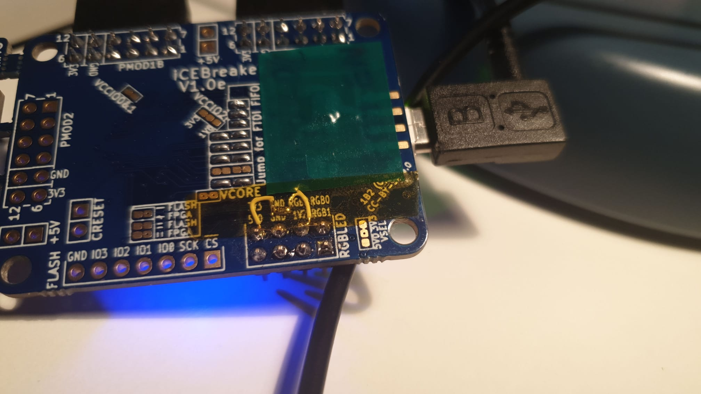
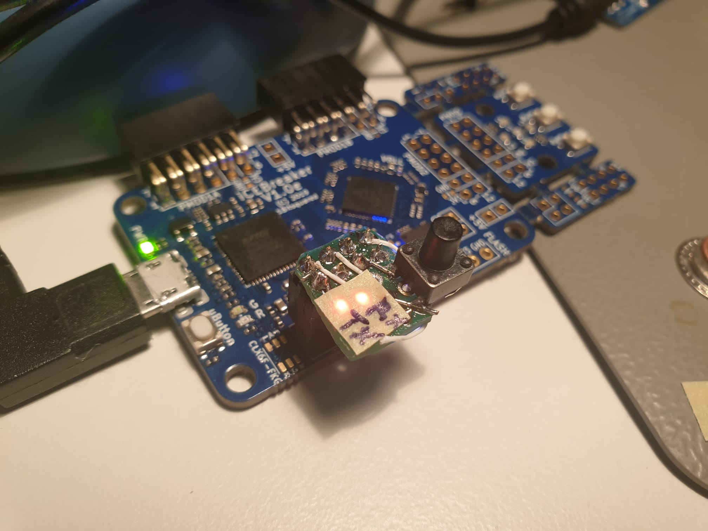
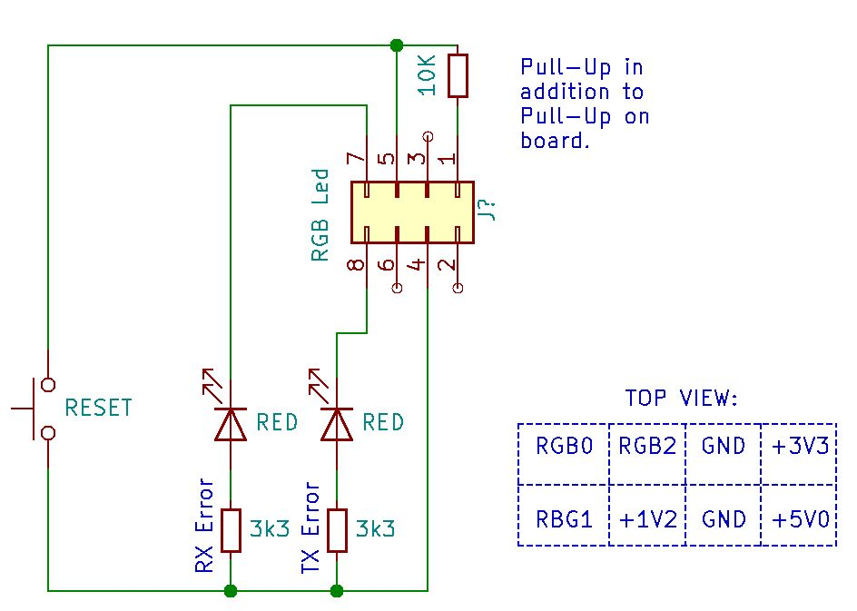

# iCEBreaker Mod
# Hardware Modifications

Everything done to the iCEBreaker board. 

(Note: This is based on my v1.0e iCEBreaker board. I don't know if this is any different for other versions)

## Isolate FIFO Interface

To be able to transmit all audio data, the FT2232H is used in FIFO mode.
Because this uses many pins in common with the PMOD2 connector, the devices on the break-off
section may interfere with the communication. 

Therefore the break-off section should either be broken-off, or the disconnected 
by removing the 2 Resistor Networks indicated below:

To be fair, I don't know if this would actually be a problem. I did not test it. 

## Connect FIFO Interface

The FIFO needs to be connected to the FPGA using the (labelled) solder jumpers on the back side of the board.
Two of them are already connected by default for UART communication. 

## Add Reset Pull-up

Because the uButton conflicts with the FIFO interface, it cannot be used as a reset button.
As there is no other GPIO left, the RGBLED port is used for additional connectivity.

The pin to which a reset button may be connected requires a pull-up, so that the project
will still function without anything attached to this port.

A 10K pull-up between the '2' Pin and '3V3' can easily be attached to the backside:

## Optional Reset Button and Status LEDs
A small board may optionally be constructed and attached to the RGBLED connector to 
add a manual reset button and a RX Error and TX Error LED.

